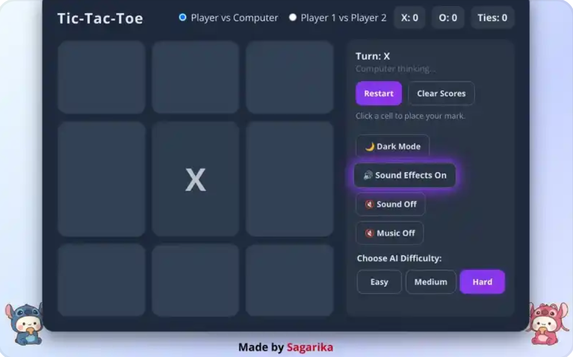

# Tic-Tac-Toe Game

A modern, responsive Tic-Tac-Toe game built with HTML, CSS, and JavaScript. Play against a computer AI with adjustable difficulty (Easy, Medium, Hard) or challenge a friend in Player vs. Player mode.

## ✨ Features

*   **Player vs. Computer Mode:** Test your skills against an AI opponent.
*   **Adjustable AI Difficulty:** Choose from Easy, Medium, or Hard AI levels.
*   **Player vs. Player Mode:** Enjoy a classic two-player game.
*   **Score Tracking:** Keeps track of wins for X, O, and ties.
*   **Sound Effects:** Engaging sound effects for moves, wins, and ties.
*   **Background Music:** Optional ambient and animated background music.
*   **Dark/Light Mode:** Toggle between dark and light themes for comfortable play.
*   **Confetti Animation:** Celebratory confetti on win.
*   **Responsive Design:** Play seamlessly on various screen sizes.
*   **Animated Stickers:** Fun, moving stickers on the page.

## 🚀 Technologies Used

*   **HTML5:** Structure of the game.
*   **CSS3:** Styling and animations.
*   **JavaScript (ES6+):** Game logic, AI, and interactivity.

## 🎮 How to Play

You can play the game by either cloning the repository or visiting the live Netlify page.

### Play Online

*   Visit the live game here: [[Tic-Tac-toe-app-by-Sagarika](https://tic-tac-toe-app-sagarika.netlify.app/)]

### Play Locally

1.  **Clone the repository:**
    ```bash
    git clone https://github.com/your-username/tic-tac-toe.git
    ```
2.  **Navigate to the project directory:**
    ```bash
    cd tic-tac-toe
    ```
3.  **Open `index.html`:**
    Simply open the `index.html` file in your web browser.

## 🕹️ Game Modes

*   **Player vs Computer:**
    *   Select "Player vs Computer" using the radio button.
    *   Choose your desired AI difficulty (Easy, Medium, Hard) using the buttons below the game board.
    *   Click on a cell to make your move. The computer will respond.
*   **Player 1 vs Player 2:**
    *   Select "Player 1 vs Player 2" using the radio button.
    *   Take turns clicking on cells to place your marks.

## ⚙️ Controls & Settings

*   **Restart Button:** Resets the current game board.
*   **Clear Scores Button:** Resets the tracked scores for X, O, and Ties.
*   **Difficulty Setting:** Choose between "Easy", "Medium", and "Hard" for the AI opponent.
*   **Theme Toggle:** Switches between Dark Mode (🌙) and Light Mode (☀️).
*   **Sound Effects Toggle:** Turns game sound effects (like move sounds, win/tie sounds) on or off.
*   **Sound On/Off (Animated):** Toggles the animated background music.
*   **Music On/Off (Ambient):** Toggles the ambient background music.

## 📸 Screenshot



## 📂 Project Structure

```
tic-tac-toe/
├── index.html          # Main game structure
├── style.css           # All CSS styling
├── script.js           # Core JavaScript game logic
├── 1.png               # Sticker image 1
├── 2.png               # Sticker image 2
├── Babyshark.mp3       # Animated background music
├── Pirouette.mp3       # Ambient background music
├── tie.mp3             # Tie game sound effect
├── win.mp3             # Win game sound effect
└── screenshot.png      # Screenshot of the game
```

## 🤝 Contributing

Contributions are welcome! If you have suggestions for improvements or new features, please open an issue or submit a pull request.

## 📄 License

This project is open source and available under the [MIT License](LICENSE).

## 🧑‍💻 Author

**Sagarika**

